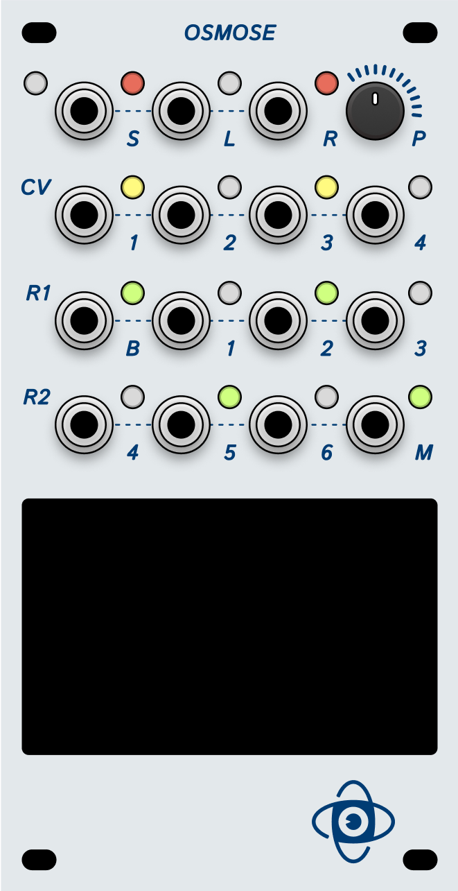

# Osmose
Harmonic Oscillator for ESP32-based microcontroller to generate a sine wave and six additional harmonics, controllable via a digital encoder. Displays resulting waveforms on a 128x128 SSD1351-based display, with selectable base frequency and musical scales.



## Base Concept
```
     +------------------+      +------------------+
     |                  |      |                  |
     |      ESP32       |      |    SSD1305 OLED  |
     |                  |      |                  |
     |    GPIO 21 (SDA) +------+ SDA              |
     |    GPIO 22 (SCL) +------+ SCL              |
     |                  |      |                  |
     |    GPIO 32 (DT)  +------+                  |
     |    GPIO 33 (CLK) +------+                  |
     |    GPIO 34 (SW)  +------+                  |
     |    GPIO 34 (CV1) +------+                  |
     |    GPIO 35 (CV2) +------+                  |
     |    GPIO 36 (CV3) +------+                  |
     |    GPIO 39 (CV4) +------+                  |
     |                  |      |                  |
     +--------+---------+      +--------+---------+
              |                         |
              |                         |
     +--------+---------+      +--------+---------+
     |                  |      |                  |
     |    MCP4725 DAC1  |      |    MCP4725 DAC2  |
     |                  |      |                  |
     |    GPIO 21 (SDA) +------+ SDA              |
     |    GPIO 22 (SCL) +------+ SCL              |
     |                  |      |                  |
     |    GPIO 25 (OUT) +------+                  |
     |                  |      |                  |
     +------------------+      +------------------+

     +------------------+
     |                  |
     |   Rotary Encoder |
     |                  |
     |    VCC (+3.3V)   |
     |    GND           |
     |    DT (A)        +-------> GPIO 32
     |    CLK (B)       +-------> GPIO 33
     |    SW (Button)   +-------> GPIO 34
     +------------------+
```